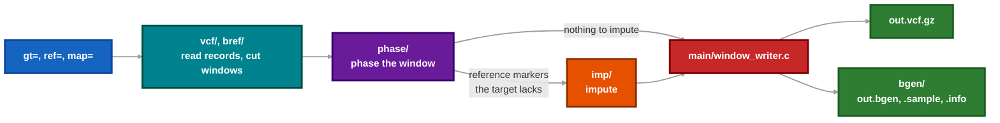

# Architecture and source layout

fast-beagle is a file-by-file C port of Beagle 5.5 (27Feb25). Its output matches Beagle's byte for byte on every oracle case (`tests/check-oracle.sh build/beagle`). [CONTEXT.md](../CONTEXT.md) defines the domain terms.

## Each window runs through four stages

`src/main/main.c` reads the parameters (`src/main/par.c`) and runs each window through these stages in turn. `src/blbutil/`, `src/beagleutil/` and `src/jcompat/` hold the utilities that every stage uses.

The port reads both input files and splits them into overlapping windows along the genetic map. It phases every window in four parts: fixed phasing inputs, the initial PBWT phase, the stage-1 iterations and stage 2. It then imputes the reference markers the target lacks. It writes Beagle's VCF with DS, DR2, AF and optional AP1/AP2 and GP fields.

## Threaded loops

The port threads the loops that dominate run time:

- reference record parsing per block
- the initial PBWT phase per window and per block of samples
- step coding per step
- stage-1 phasing and parameter estimation per sample
- stage 2 per sample
- the IBS neighbour searches per batch of steps
- imputation per haplotype
- the imputed writer, which builds records on worker threads and prints them in order

`nthreads=` sets both the thread count and the partitions that Beagle's output depends on, so the output matches Beagle run with the same thread count. [tla/ParallelOrdered.tla](../tla/ParallelOrdered.tla) models the protocol of `parallel_ordered`, the pipelined imputed writer. [tla/BlockReader.tla](../tla/BlockReader.tla) and [tla/SlidingWindow.tla](../tla/SlidingWindow.tla) model the reference-reading pipeline and the read-ahead hand-over. [tla/FatalExit.tla](../tla/FatalExit.tla) models the fatal-error lifecycle of `util_exit` across threads, and [tla/BgenCleanup.tla](../tla/BgenCleanup.tla) the removal of partial BGEN output ([model check](testing.md#model-check-the-thread-protocols)).

A failed allocation calls `util_oom`, which ends the process even inside `util_try`. An input error inside `util_try` unwinds to its frame instead, so the code raises input errors outside its locks ([lock check](testing.md#lock-check)).

The imputation writer splits a long cluster into work items of at most `PIECE_RECORDS` reference markers (500). `PIECE_RECORDS` is a tuning value that must not change the output ([piece size check](testing.md#piece-size-check)).

## Source layout

- `src/`: the C port. Its directories mirror the Java packages (`blbutil`, `beagleutil`, `vcf`, `main`, …), and each file names the Java file it was ported from.
- `src/jcompat/`: C reproductions of the Java library behaviour Beagle depends on. `make check-jcompat` compares each against output printed by real Java (`tests/jcompat/JcompatFixtures.java`).
- `src/vcf/interval_it.c`: the `chrom=` interval that both the target and the reference records pass through. It skips records before the interval, and the first record after the interval ends the stream. It reads the source at most one record past the interval. With no interval, every record passes through.
- `src/beagleutil/comp_hap_queue.c`: the composite haplotype tracker.
- `src/bgen/`: the BGEN writer for `bgen=plink2` and `bgen=phased` ([BGEN output](usage.md#bgen-output)).
- `src/main/vcf_index.c`: the tabix index writer for `tbi=true`.
- `src/main/run_outputs.c`: the output destinations and their collision checks against the inputs. Writers borrow its paths and keep their format encoding and close operations.
- `src/bgen/bgen_files.c`: removal of partial BGEN output at process exit. Main registers the cleanup before the readers start, because any thread's fatal error can run it. Opening a member and recording it for removal happen under one lock, and cleanup is terminal, so a later open cannot recreate a removed file. Completed members survive a later failure. A caught read-ahead error does not exit, so outputs stay writable until the consumer raises it.
- `third_party/libdeflate/`: the files of libdeflate 1.25 (MIT, `COPYING`) that zlib compression needs. They come from plink2's source tree at tag v2.0.0-a.7.8. plink2 compresses BGEN with this library at level 6. zlib's own deflate gives different bytes.
- `java/src/`: the unmodified Beagle 5.5 Java source, used as the oracle.
- `java/trace.patch`: trace hooks for the Java source ([trace seams](testing.md#compare-trace-seams)).
- `tests/`: the checks ([checks and the pre-merge gate](testing.md)).
- `tla/`: the TLA+ models of the thread protocols.

## Tabix index in the same pass

`src/main/vcf_index.c` records each line's chromosome, interval and uncompressed end as the VCF is written. It then reads the BGZF block headers of the closed file to place those ends, so it works with the multithreaded writer.
